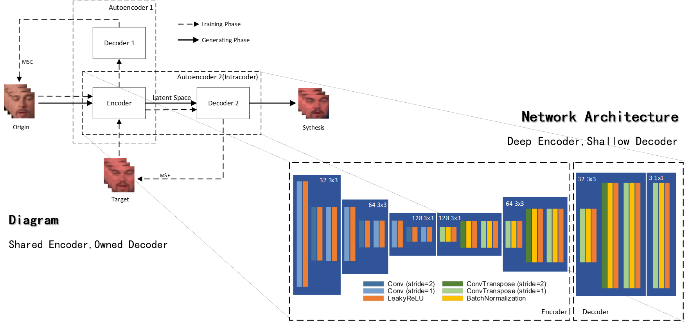

# Faceswap

This is my graduate design for bachelor degree. The main focus will be the implementation of a complete pipeline of face swap (or deepfake generation) rather than innovations. 

The capability of this pipeline is very limited. It cannot cope with drastic gestures, tiny region of interests, inappropriate light, etc.

For better methods/algorithms/implementations of face swap, you may check:

- https://github.com/deepfakes/faceswap
- https://github.com/MarekKowalski/FaceSwap
- https://github.com/shaoanlu/faceswap-GAN

But if you just want to go through a complete process, this will be a project simple enough to understand the internal mechanism.

## Preface

This is purely a graduate design. There are many faults in the pipeline that you may improve, but I do not suggest. A fine tuned face swap method will be a severe threat as far as I can see, so this is just for research and entertainment. 

***If it is adopted for illegal purpose (although I doubt the possiblity), I will not take any responsibility for it.*** 

You can run it by

```shell
python faceSwapPipeline.py
```

The generated video can be found in `datasets/generated`

You can check the process through `swap.log` in `logs`

## Results

The results are acquired on the Celeb-DF dataset (http://www.cs.albany.edu/~lsw/celeb-deepfakeforensics.html).

### Face swap performance


The solid line connects faces with same gesture, the dotted line connects faces with same identity. The performance of this algorithm I adopted is limited as you can see.

There are two major faults:

- Limited resolution - expected blur is introduced by convolution.
- Feature fusion - generated face shares features both from gesture donator and identity donator.

### Deepfake performance

<table>
    <tr>
        <td>Gesture donator (or background)</td>
        <td>Identity donator (or foreground)</td>
        <td>Deepfake generated</td>
    </tr>
    <tr>
        <td></td>
        <td></td>
        <td></td>
    </tr>
</table>


The problem is very obvious. The pipeline only tampered the core zone of human face (eyes, nose, mouse, chicks, etc.). After color correction, the tampered zone become subtle in the background, making the generated deepfake not that fake.

But this problem comes from the mechanism of the generating process I adopted, it appears in other methods with the same mechanism too.

## Algorithm


Since the major concern is face swapping, I adopted a public version of  MTCCN for face detection (https://github.com/imistyrain/MTCNN). 

For the alignment and de-alignment of face, I adopted the reference points and methods publicly mentioned in zhihu (https://zhuanlan.zhihu.com/p/61343643).

For the fusion of images, the blending of foreground and background, I configured the classical Poisson Image Blending for my own purpose.

The last two modules will be the major works:

- Intracoder - swap the faces.
- Color correction - transfer color style for the generated face. 

### Intracoder



The "intracoder" is a pair of autoencoders trained and used with swapped decoder. I adopt the most common structure of stacked convolutional layers. 

The shared encoder is deeper than seperate decoder as shown. It's designed under the presumption that the deep layer contains more abstract information of input and shallow layer contains more concrete information of input.

The desire to change identity while sustain gesture means to sustain abstract parts and configure concrete parts.

### Color correction


The module of color correction has two functions:

- Transfer mismatched color style of generated faces.
- Super-resolute the generate faces to make it more clear.

Color information is a very shallow and very concrete information in the theory mentioned above in the section of intracoder. The faces generated by intracoder will have the color style of identity donator, which is mismatched with that of gesture donator.

There is actually a very classic and very efficient color transfer algorithm adopted by many other implementations. 

But in my scenario, I also wish to upsample the generated faces so that I could train the intracoder in small images for better performance. So I create a mixture.

## Future

 I believe that this techique can be adopted for good purpose and Disneyland has made its effort. If utilized properly, this could be a revolution for movie factory and other related infustries.

